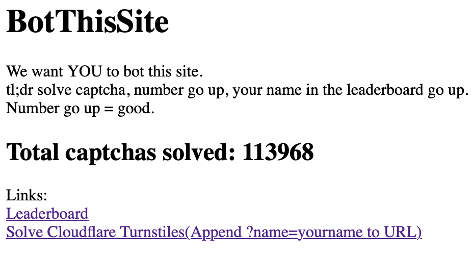
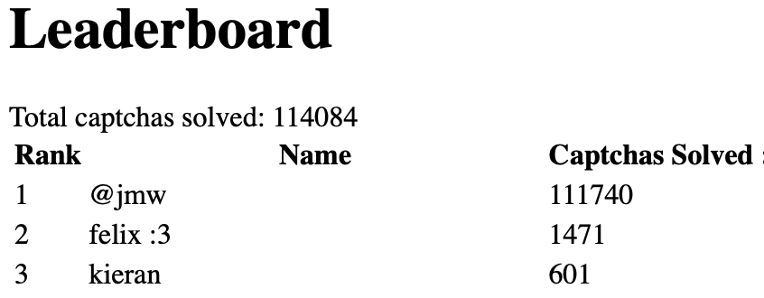
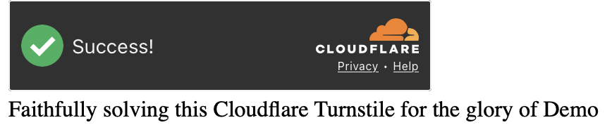

# BotThisSite

We want you to absolutely not bot this site. \
It's probably forbidden to bot this site. \ 
Absolutely forbidden. After all, we're protected by captchas \ 
Surely you can't bot this site after all, I'm behind 7(todo) captchas.... \
If you somehow magically do it :tm:, we will record your name and how many times you do it. \ 
So, like, a leaderboard where if you solve the captcha number go up, number go up = good \
The site is intentionally sparse until I add CSS, and you should memorize links 

## Images:
\
\

## Tech Stack:
If premature optimization is a sin, then i should be in heaven for how tossed-together this is. \ 
I personally feel like this should implode but its not! so good! \
* Python - the ... language?  
* FastAPI - the api thingy  
* Jinja2 templates - for making pages with templates... 
* SQLite + SQLmodel- databae  
* Cloudflare Turnstiles - this is the first captcha implemented. 
* Nest - hosting provider 

## Todo
* Add more captchas 
* gh shield 
* better activity stuff
* "ratelimiting"
* ratelimit only counts *failed* captcha verifies
* ratelimit counts how many unique names per ip

## AI Usage:

* AI usage was kept low \
* AI use was under 30% \
* Code is primarily human written, I intend to keep it this way.
* AI was used for assistance when i was stuck/confused how to continue.
* Amp Code was one of the tools utilized.
* I wish I had all the skills to efficiently do it how the LLM does it - while it makes mistakes, I do intend to still learn.
* as of the current commit, the migration to more models and better provider setups was handled by amp code. (it convinced me to not have everything as a sql column)

## prod was on:
commit e6b2d9aa9b64a1ae035dff71aa5e353336a6eeba (HEAD -> main, origin/main, origin/HEAD)

